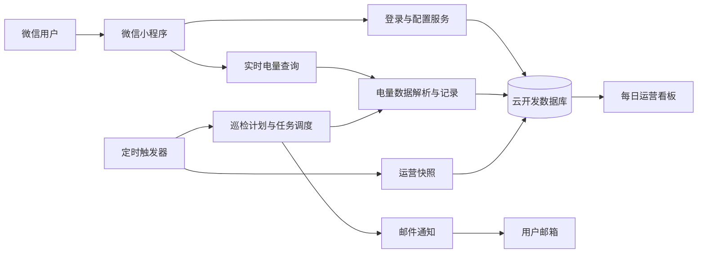

# duaa 宿舍电量提醒

<p align="center">
  面向宿舍电费查询与低电量提醒的微信小程序，让电量查询和余额提醒更简单、更稳定。
</p>

<p align="center">
  
  
  
  
</p>

> 本项目是一个基于微信小程序与微信云开发构建的宿舍电量管理工具，支持电表绑定、实时电量查询、低电量提醒、定时检查和运行数据统计。

## 功能特性

- **宿舍电表绑定**：配置宿舍信息并绑定照明或空调电表。
- **实时电量查询**：在小程序首页快速查看当前剩余电量。
- **低电量提醒**：根据用户配置的阈值判断电量状态，并通过邮件发送提醒。
- **定时巡检**：云函数按照计划自动检查已绑定电表，无需用户手动打开小程序。
- **分级调度**：根据正常、临近阈值和已通知等状态调整检查计划，降低不必要的请求。
- **配置管理**：支持更新和解绑电表配置，并处理并发绑定与清理场景。
- **访问保护**：电量查询包含频率限制，避免短时间内重复请求。
- **运行统计**：生成每日运营数据及定时快照，便于排查异常和观察服务状态。
- **自动化测试**：覆盖计划生成、执行量估算、并发绑定、请求限流、解绑及运营看板等关键逻辑。

## 技术栈

- 微信小程序原生框架
- TypeScript
- Sass / SCSS
- Glass Easel 与 Skyline 渲染器
- 微信云开发与云函数
- 云开发数据库
- Node.js
- Nodemailer
- CloudBase Node.js SDK

## 系统架构



## 项目结构

```text
duaa-power-reminder/
├── miniprogram/                  # 微信小程序客户端
│   ├── assets/                   # 图片等静态资源
│   ├── components/               # 公共组件
│   ├── data/                     # 宿舍映射数据
│   ├── pages/                    # 首页、设置、登录、关于等页面
│   ├── services/                 # 登录、配置及电量查询服务
│   ├── types/                    # 客户端领域类型
│   └── utils/                    # 电量状态和宿舍映射工具
├── cloudfunctions/               # 微信云函数
│   ├── login/                    # 用户登录与身份识别
│   ├── queryPower/               # 实时电量查询
│   ├── saveConfig/               # 保存及更新电表配置
│   ├── unbindConfig/             # 解绑并清理电表配置
│   ├── scheduledCheck/           # 生成定时巡检计划
│   ├── scheduledCheckDispatch/   # 分发并执行巡检任务
│   ├── sendEmailNotification/    # 发送低电量邮件
│   ├── scheduledDashboardSnapshot/ # 生成运营快照
│   └── shared/                   # 数据库、调度和解析公共逻辑
├── scripts/                      # 测试及运营看板脚本
├── outputs/                      # 本地生成的运营输出
├── project.config.json           # 微信开发者工具项目配置
├── tsconfig.json                 # TypeScript 配置
└── package.json                  # 项目依赖与脚本
```

## 云函数说明

| 云函数 | 职责 |
| --- | --- |
| `login` | 获取并识别当前微信用户 |
| `queryPower` | 查询电表数据、解析剩余电量并记录结果 |
| `saveConfig` | 保存用户宿舍、电表、阈值及通知配置 |
| `unbindConfig` | 解绑配置并清理相关电表状态 |
| `scheduledCheck` | 计算定时巡检计划 |
| `scheduledCheckDispatch` | 按计划分发和执行电量检查 |
| `sendEmailNotification` | 发送低电量邮件通知 |
| `scheduledDashboardSnapshot` | 保存每日运营指标快照 |
| `clearDatabase` | 手动清空所有项目集合中的文档，但保留集合本身 |

## 开始使用

### 环境要求

- Node.js 18 或更高版本
- npm
- 微信开发者工具
- 已开通云开发能力的微信小程序账号
- 可用于发送提醒邮件的 SMTP 邮箱

### 1. 克隆仓库

```bash
git clone https://github.com/wtx1717/duaa-power-reminder.git
cd duaa-power-reminder
```

### 2. 安装根目录依赖

```bash
npm install
```

### 3. 导入微信开发者工具

在微信开发者工具中选择“导入项目”，将项目目录指向仓库根目录。工具会根据 `project.config.json` 自动识别：

- 小程序目录：`miniprogram/`
- 云函数目录：`cloudfunctions/`

请将项目 AppID 和云开发环境调整为你自己的配置。不要直接在公开仓库中提交生产环境密钥、SMTP 授权码或其他敏感信息。

### 4. 配置云开发环境

当前客户端在 `miniprogram/app.ts` 中初始化云开发环境。部署自己的实例时，请替换为目标环境 ID：

```ts
wx.cloud.init({
  env: 'your-cloud-environment-id',
  traceUser: true,
})
```

同时创建代码中使用的数据库集合，并按照最小权限原则配置集合读写权限。集合结构应以 `cloudfunctions/shared/types.ts` 和 `cloudfunctions/shared/db.ts` 中的定义为准。

### 5. 配置邮件通知

`sendEmailNotification` 使用 Nodemailer 发送提醒邮件。请通过云函数环境变量或其他安全的密钥管理方式配置 SMTP 信息，不要将账号密码写入源码。

建议至少配置以下信息：

```text
SMTP_HOST
SMTP_PORT
SMTP_USER
SMTP_PASS
SMTP_FROM
```

实际变量名称及读取方式请与 `cloudfunctions/sendEmailNotification/index.js` 中的实现保持一致。

### 6. 安装并部署云函数

在微信开发者工具中依次选择 `cloudfunctions` 下的各个函数，执行“上传并部署：云端安装依赖”。

建议部署顺序：

1. `login`
2. `queryPower`
3. `saveConfig`
4. `unbindConfig`
5. `sendEmailNotification`
6. `scheduledCheck`
7. `scheduledCheckDispatch`
8. `scheduledDashboardSnapshot`

`clearDatabase` 不属于正常业务链路，只有在确认备份并暂停相关定时任务后，才应在云开发控制台手动调用。请先为云函数配置环境变量 `CLEAR_DATABASE_CONFIRMATION`，再在调用事件中传入对应的 `confirm` 值。

定时触发器配置位于相应云函数的 `config.json` 中。部署后请在云开发控制台检查触发器是否创建成功，并确认时区与预期执行时间一致。

## 本地测试

运行全部测试：

```bash
npm test
```

也可以单独执行测试：

```bash
npm run test:scheduled-plan
npm run test:scheduled-estimate
npm run test:meter-binding
npm run test:query-rate-limit
npm run test:unbind
npm run test:dashboard-daily
npm run test:dashboard-snapshot
```

当前测试重点覆盖：

- 定时巡检随机计划生成
- 计划执行量估算
- 电表绑定并发控制
- 实时查询频率限制
- 配置解绑与数据清理
- 每日运营数据聚合
- 运营快照生成

## 运营看板

生成本地每日运营看板：

```bash
npm run generate:dashboard
```

默认输出位于：

```text
outputs/ops/dashboard-daily.html
```

运营输出可能包含内部运行数据。将仓库设为公开前，请检查 `outputs/` 中的文件，避免提交用户信息、OpenID、邮箱、电表编号或其他敏感数据。

## 代码阅读导览

如果你没有 JavaScript 基础，建议按照下面的顺序阅读。这个项目不是把所有代码都放在一个文件里，而是把“页面显示”“网络调用”“云函数业务”和“数据库记录”分开了。

### 推荐阅读顺序

1. `miniprogram/types/domain.ts`：先看小程序端使用的数据类型，例如电表、用户配置和查询结果。
2. `miniprogram/utils/power-state.ts`：了解页面状态是怎样创建和更新的。
3. `miniprogram/services/api.ts`、`auth.ts`、`meter.ts`：了解小程序如何调用云函数。
4. `miniprogram/pages/index/index.ts` 和 `settings/settings.ts`：了解首页查询、登录、配置保存和解绑流程。
5. `cloudfunctions/shared/types.ts` 和 `db.ts`：了解云函数端的数据库集合与数据结构。
6. `cloudfunctions/queryPower/index.js`、`saveConfig/index.js` 和 `unbindConfig/index.js`：了解实时查询、绑定和解绑。
7. `cloudfunctions/scheduledCheck/index.js`、`scheduledCheckDispatch/index.js` 以及 `shared/scheduledExecutor.js`：了解定时巡检的计划、分发和执行。
8. `cloudfunctions/scheduledDashboardSnapshot/index.js`、`scripts/generate-dashboard-daily.js` 和 `scripts/dashboard-runtime.js`：了解运营数据如何生成并展示。

### 一次实时查询的流程

1. 用户在首页点击“查询当前电量”。
2. `miniprogram/pages/index/index.ts` 同时为照明和空调调用 `queryPower()`。
3. `miniprogram/services/api.ts` 通过 `wx.cloud.callFunction()` 发起云函数调用。
4. `cloudfunctions/queryPower/index.js` 检查用户是否绑定了该电表，并检查手动查询限流状态。
5. 云函数请求学校电量页面，解析剩余电量、截止时间和地址。
6. 查询结果写入 `power_records`，电表当前状态写入 `meters`。
7. 结果返回小程序，小程序更新页面状态和本地缓存。

### 一次定时巡检的流程

1. `scheduledCheck` 在允许的工作时间运行。
2. 它找出到达 `nextCheckAt` 的电表，跳过正在执行任务的电表。
3. `shared/scheduledPlanner.js` 为电表生成随机分布在 25 分钟窗口内的任务。
4. 任务写入 `meter_check_jobs`，由 `scheduledCheckDispatch` 按计划时间取出。
5. 分发函数限制并发量，并调用 `shared/scheduledExecutor.js` 执行查询。
6. 执行器更新电表用量估算、下次检查时间和任务状态。
7. 若电量低于提醒阈值，执行器调用 `sendEmailNotification`。
8. 邮件发送结果写入 `notification_records`，便于去重和运营统计。

### 运营看板流程

1. `scheduledDashboardSnapshot` 按北京时间生成当天的数据库快照。
2. 快照汇总用户数、电表状态、查询记录、通知记录和任务记录。
3. `scripts/generate-dashboard-daily.js` 读取快照并生成本地看板 HTML。
4. `scripts/dashboard-runtime.js` 在浏览器中加载快照索引、切换日期、渲染表格和显示电表详情。
5. `scripts/dashboard-preview-server.js` 提供本地静态文件和看板刷新接口。

### 数据库集合关系

| 集合 | 作用 |
| --- | --- |
| `user_configs` | 保存用户与两块电表、提醒邮箱之间的绑定关系。 |
| `meters` | 保存电表当前状态、失败次数、用量估算和下次检查时间。 |
| `power_records` | 保存每次成功或失败的电量查询结果。 |
| `user_query_state` | 保存手动查询的时间戳和锁，防止短时间重复查询。 |
| `meter_check_jobs` | 保存定时巡检任务及其执行状态。 |
| `notification_records` | 保存低电量提醒的发送、失败或跳过记录。 |
| `job_locks` | 防止多个定时计划函数同时生成重复任务。 |
| `ops_dashboard_snapshots` | 保存每日运营看板快照。 |

### 常见 JavaScript / TypeScript 语法

| 写法 | 在本项目中的含义 |
| --- | --- |
| `const` / `let` | 声明变量；`const` 不能重新赋值，`let` 可以重新赋值。 |
| `async function` | 声明异步函数，通常用于数据库或网络操作。 |
| `await` | 等待一个 Promise 完成，让异步代码按顺序阅读。 |
| `Promise.all([...])` | 同时等待多个异步操作，首页用它同时查询两块电表。 |
| `{ ...oldState, value }` | 展开旧对象，再用后面的字段覆盖同名字段。 |
| `const { OPENID } = context` | 从对象中取出名为 `OPENID` 的属性。 |
| `value ? a : b` | 条件表达式，条件成立取 `a`，否则取 `b`。 |
| `value?.field` | 可选链；`value` 不存在时不会报错，而是得到 `undefined`。 |
| `type A = 'x' \| 'y'` | TypeScript 联合类型，表示值只能是列出的几种情况。 |
| `interface A { ... }` | TypeScript 对对象形状的说明，只在编译阶段帮助检查。 |
| `as SomeType` | 类型断言，告诉 TypeScript 按指定类型理解一个值，不会改变运行时数据。 |
| `map` / `filter` / `reduce` | 分别用于转换数组、筛选数组和汇总数组。 |
| `try ... catch ... finally` | 捕获错误；`finally` 中的代码无论成功失败都会执行。 |

### 配置文件说明

JSON 格式本身不允许写注释，因此 `app.json`、页面 JSON、云函数 `config.json`、`package.json` 等文件保持严格 JSON 格式。它们的职责如下：

- `project.config.json`：微信开发者工具的项目根目录、编译器和渲染器配置。
- `project.private.config.json`：本地开发专用的 AppID 和开发者工具设置，不应提交到公开仓库。
- `miniprogram/app.json`：小程序页面列表、导航栏、TabBar、隐私检查和渲染器设置。
- 各页面或组件目录下的 `.json`：声明页面/组件是否使用自定义导航栏、组件和局部配置。
- 云函数目录下的 `package.json`：声明云函数入口文件和依赖。
- 云函数目录下的 `config.json`：声明定时触发器及其 Cron 表达式。
- 根目录 `package.json`：声明测试、看板生成、预览服务等本地命令。
- `.env`：本地或看板脚本使用的敏感配置，不能提交真实密钥。

## 定时任务

项目当前包含以下定时任务配置：

- 工作时段每 30 分钟生成一次巡检计划。
- 每晚执行一次最终计划生成。
- 工作时段每 5 分钟分发一次待执行任务。
- 夜间额外执行队列收尾任务。
- 每晚生成一次运营数据快照。

具体 Cron 表达式定义在各云函数的 `config.json` 中。修改执行频率前，应同时评估云函数调用量、上游查询限制和邮件发送频率。

## 安全与隐私

- 不要提交小程序密钥、SMTP 授权码或云开发访问凭据。
- 用户身份、邮箱、电表编号和宿舍信息应按敏感数据处理。
- 云数据库权限应遵循最小权限原则，避免客户端直接修改服务端状态字段。
- 上线前请检查微信小程序隐私保护指引及相关数据处理声明。
- 若公开运营日志或看板，应先移除所有可识别用户的信息。

## 已知限制

- 电量数据依赖上游查询页面或接口，其结构变化可能导致解析失败。
- 邮件到达时间受 SMTP 服务商及用户邮箱反垃圾策略影响。
- 定时任务的实际执行时间可能受到云函数冷启动和平台调度影响。
- 不同云开发环境需要分别配置数据库、环境变量和定时触发器。

## 贡献指南

欢迎通过 Issue 或 Pull Request 提交问题与改进建议。

1. Fork 本仓库。
2. 创建功能分支：`git checkout -b feature/your-feature`。
3. 完成修改并补充必要测试。
4. 运行 `npm test`，确认现有用例通过。
5. 提交清晰的 Commit。
6. 创建 Pull Request，并说明改动背景、实现方式和验证结果。

提交安全问题时，请不要在公开 Issue 中附带真实用户数据、密钥或可利用的敏感细节。

## 反馈与联系

- GitHub Issues：<https://github.com/wtx1717/duaa-power-reminder/issues>
- 项目仓库：<https://github.com/wtx1717/duaa-power-reminder>
- 邮箱：<13100162717@163.com>

## 许可证

当前仓库尚未声明开源许可证。在添加明确的 `LICENSE` 文件前，默认保留所有权利。若计划接受外部贡献或允许他人复用代码，建议尽快选择并添加合适的开源许可证。

---

如果这个项目对你有帮助，欢迎为仓库点一个 Star，或通过 Issue 分享使用反馈。
