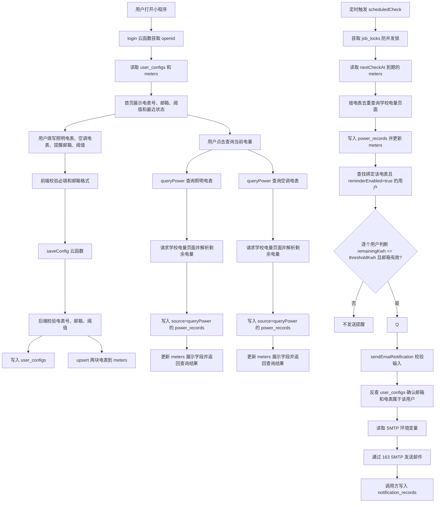

# 程序逻辑链路图

当前版本以“用户保存配置 -> 后台定时查询 -> 按阈值判断 -> 邮件提醒”为主链路。手动查询只用于查看当前电量和保留查询历史，不参与调度估算或低电量周期提醒判断。微信订阅消息接口保留，但不再实际弹窗或发送。

## 关键规则

- 保存配置时邮箱必填，旧用户需要重新保存一次配置补齐 `email`。
- 照明和空调电表都会参与后台提醒判断。
- 邮件提醒只由 `scheduledCheck` 触发，触发条件是后台查询结果 `remainingKwh <= thresholdKwh`。
- `queryPower` 写入 `source=queryPower` 的历史记录，但不更新 `nextCheckAt`、`scheduleMode` 或 `estimatedDailyUsageKwh`。
- 邮件中的查询时间按 `MAIL_TIME_ZONE` 环境变量格式化，未配置时默认使用 `Asia/Shanghai`。
- `notification_records.channel` 当前写入 `email`。

## 需要重新上传的云函数

- `sendEmailNotification`：修复邮件查询时间展示。
- 其他云函数本次未改动时不必重新上传。
